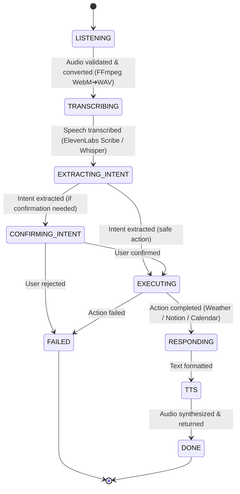

<div align="center">

# 🤖⚡ ULTRON V1

### **The Autonomous, Multi-Modal & Screen-Aware Voice AI Agent Engine**
*Transforming Voice Input ➔ Structured Intent ➔ Real-World Autonomous Execution*

[](https://www.python.org/)
[](https://fastapi.tiangolo.com/)
[](https://nextjs.org/)
[](https://www.typescriptlang.org/)
[](https://tailwindcss.com/)
[](LICENSE)

[**Explore Documentation**](docs/README.md) • [**Quick Start**](#-quick-start) • [**Architecture**](#-architecture--pipeline) • [**Roadmap**](#-the-8-level-agentic-roadmap) • [**Developer Guide**](docs/06_DEVELOPER_CONTRIBUTION_GUIDE.md)

</div>

---

## 💡 What is Ultron V1?

**Ultron V1** (formerly *Jarvis 2.0*) is a production-grade, voice-first autonomous AI assistant. Unlike simple text-only chatbots, Ultron listens to spoken audio or typed prompts, extracts structured intent using function-calling LLMs, and **takes real action** across external services—fetching real-time weather forecasts, managing Notion task databases, and scheduling Google Calendar agendas, before speaking back to the user in a natural human voice.

```
┌─────────────────────────────────────────────────────────────────────────┐
│                           ULTRON V1 PIPELINE                            │
│                                                                         │
│  🎙️ Voice Mic ➔ 👂 STT Scribe ➔ 🧠 LLM Intent ➔ ✋ Action ➔ 🗣️ TTS Voice  │
└─────────────────────────────────────────────────────────────────────────┘
```

> [!TIP]
> **Zero Proprietary Lock-In**: Ultron V1 is engineered with cross-platform Python, non-blocking async FastAPI, and browser-native Web Audio API visualizers.

---

## 📚 Interactive Documentation Hub

Click any of the cards below to dive into the comprehensive documentation suite:

<table>
  <tr>
    <td width="50%">
      <h3>📄 <a href="docs/01_PROJECT_OVERVIEW.md">Project Overview</a></h3>
      <p>Plain-English conceptual summary using 5 intuitive human analogies (<i>The Ears, The Brain, The Hands, The Voice, The Logbook</i>).</p>
    </td>
    <td width="50%">
      <h3>📜 <a href="docs/02_PAST_VERSIONS_AND_EVOLUTION.md">Past Versions & History</a></h3>
      <p>The journey from <b>Jarvis 2.0 ➔ Ultron V1</b>, phase-by-phase history, and 4 major engineering battles solved.</p>
    </td>
  </tr>
  <tr>
    <td width="50%">
      <h3>🏗️ <a href="docs/03_CURRENT_ARCHITECTURE.md">Current Architecture</a></h3>
      <p>Technical breakdown of the 7-Stage State Machine, FastAPI backend, Next.js UI, & Supabase run telemetry.</p>
    </td>
    <td width="50%">
      <h3>🚀 <a href="docs/04_FUTURE_ROADMAP.md">Future Agentic Roadmap</a></h3>
      <p>The 8-Level Agentic Capability Ladder: Screen Vision (Moondream), ReAct Task Planning, & OS RPA Desktop Automation.</p>
    </td>
  </tr>
  <tr>
    <td width="50%">
      <h3>🛠️ <a href="docs/05_NON_TECH_USER_GUIDE.md">Non-Tech User Guide</a></h3>
      <p>Simple 3-step launcher guide (<code>run_ultron.bat</code>), voice prompts to try out, & mic troubleshooting.</p>
    </td>
    <td width="50%">
      <h3>💻 <a href="docs/06_DEVELOPER_CONTRIBUTION_GUIDE.md">Developer Guide</a></h3>
      <p>Complete directory map, request execution trace, & step-by-step developer recipes to extend Ultron V1.</p>
    </td>
  </tr>
</table>

---

## 📐 Architecture & Pipeline

Ultron V1 orchestrates requests through an **explicit 7-stage assembly-line state machine**:

<details open>
<summary><b>🔍 View State Machine Mermaid Flowchart (Click to collapse)</b></summary>

<br />



</details>

### 7-Stage Assembly Line Specification

| Stage | Name | Input ➔ Output | Primary Tech |
| :---: | :--- | :--- | :--- |
| **01** | `LISTENING` | Browser audio blob ➔ Validated WAV bytes | Native Header Signature Check + FFmpeg |
| **02** | `TRANSCRIBING` | WAV audio bytes ➔ Text transcript | ElevenLabs Scribe v2 / Groq Whisper API |
| **03** | `EXTRACTING_INTENT` | Text transcript ➔ Typed Pydantic Intent Object | Groq Qwen 3.6 / Llama 3 Tool-Calling |
| **04** | `CONFIRMING_INTENT` | Confidence threshold check ➔ Approved Intent | State Machine Policy Engine |
| **05** | `ACTION_EXECUTION` | Intent Object ➔ External Service Output | WeatherAPI.com / Notion API / Google Calendar |
| **06** | `RESPONDING` | Action Output ➔ Formatted Natural Response Text | `src/ultron/stages/response.py` |
| **07** | `TTS` | Response Text ➔ Synthesized MP3 Speech Audio | ElevenLabs Multilingual v2 Custom Voice |

---

## 🪜 The 8-Level Agentic Roadmap

Ultron V1 is built on an ambitious **8-Level Capability Ladder**:

```
 ┌────────────────────────────────────────────────────────────────────────┐
 │ LEVEL 8 │ Autonomous Skill Synthesis & Demonstration Learning [Planned]│
 │ LEVEL 7 │ Autonomous Goal Pursuit ("Keep inbox at zero")     [Planned]│
 │ LEVEL 6 │ OS & App Automation (RPA Desktop Control)          [Planned]│
 │ LEVEL 5 │ Screen Vision & Context Awareness (Moondream/OCR)  [Planned]│
 │ LEVEL 4 │ Multi-Step ReAct Planning & Tool Chaining          [Active 🚧]│
 │ LEVEL 3 │ Proactive Daily Briefings & Scheduled Cron          [LIVE ✅] │
 │ LEVEL 2 │ Multi-Turn Conversation & Session History          [LIVE ✅] │
 │ LEVEL 1 │ Single-Turn Voice-to-Action Execution              [LIVE ✅] │
 └────────────────────────────────────────────────────────────────────────┘
```

---

## ⚡ Quick Start

> [!IMPORTANT]
> Ensure you have **Python 3.11+**, **Node.js 18+**, and **FFmpeg** installed on your system.

### 1. Installation

```bash
# 1. Clone the repository
git clone https://github.com/LuckyRathee/ULTORN-v1.git
cd ULTORN-v1

# 2. Create Python virtual environment
python -m venv .venv
source .venv/bin/activate  # On Windows: .\.venv\Scripts\Activate.ps1

# 3. Install Backend Dependencies
pip install -r requirements.txt

# 4. Copy Environment Template
cp .env.example .env
```

### 2. Environment Configuration (`.env`)

```env
# Application Host Settings
APP_HOST=0.0.0.0
APP_PORT=8000
LOG_LEVEL=INFO

# Supabase Telemetry Tracing (Optional / Recommended)
SUPABASE_URL=https://your-project.supabase.co
SUPABASE_SERVICE_KEY=your-supabase-service-key

# Speech-to-Text (STT)
STT_PROVIDER=elevenlabs # Options: elevenlabs, groq
ELEVENLABS_API_KEY=your-elevenlabs-api-key
GROQ_API_KEY=your-groq-api-key

# Intent Extraction LLM
LLM_PROVIDER=groq
INTENT_MODEL=qwen/qwen3.6-27b

# External Integration Credentials
WEATHER_API_KEY=your-weatherapi-key
NOTION_API_KEY=your-notion-integration-key
NOTION_DATABASE_ID=your-notion-database-id
```

### 3. Launching Localhost Deployment

<details open>
<summary><b>🚀 One-Click Windows Launcher (Recommended)</b></summary>

Simply double-click **`run_ultron.bat`** in the root directory. It spins up FastAPI (`:8000`) and Next.js (`:2311`), automatically opening **`http://localhost:2311`** in your default browser.

</details>

<details>
<summary><b>💻 Manual Terminal Commands</b></summary>

```bash
# Terminal 1: Start Backend Server
.\.venv\Scripts\Activate.ps1
uvicorn --app-dir src ultron.main:app --reload --host 0.0.0.0 --port 8000

# Terminal 2: Start Frontend Next.js Cockpit
cd frontend
npm run dev
```

</details>

---

## 📡 Interactive API Reference

<details>
<summary><b>🔍 Click to view API Endpoint Payload Examples</b></summary>

<br />

### 1. Process Text Command
```http
POST /api/v1/process-text
Content-Type: application/json

{
  "text": "What is the weather in London?",
  "session_id": "session_user_123"
}
```

### 2. Process Audio Command (Base64)
```http
POST /api/v1/process-audio
Content-Type: application/json

{
  "audio_base64": "UklGRiQAAABXQVZFZm10IBAAAAABAAEARKwAAIhYAQACABAAZGF0YQ...",
  "session_id": "session_user_123"
}
```

### 3. Health Check
```http
GET /health
```

**Response Example:**
```json
{
  "status": "healthy",
  "version": "1.0.0",
  "checks": { "supabase": "ok", "stt": "ok", "llm": "ok", "weather_api": "ok" },
  "uptime_seconds": 120
}
```

</details>

---

## 🧪 Testing & Verification

```bash
# Run unit test suite (excluding live API integration tests):
python -m pytest -m "not integration" -v

# Run full test suite with coverage report:
python -m pytest --cov=src/ultron tests/

# Test Next.js production build:
cd frontend && npm run build
```

---

## 🗂️ Codebase Architecture Map

```
ULTORN-v1/
├── docs/                        # Complete 6-Part Documentation Suite
├── src/ultron/                  # Backend Python Engine
│   ├── main.py                  # FastAPI Entry Point & Endpoints
│   ├── config.py                # Pydantic Settings Configuration Loader
│   ├── schemas/                 # Pydantic Schemas (Intent, API, Pipeline)
│   ├── state/                   # 7-Stage State Machine Orchestrator
│   ├── stages/                  # Assembly-Line Stage Execution Functions
│   ├── services/                # Integration Connectors (STT, LLM, TTS, Weather, Notion, Calendar)
│   ├── memory/                  # Session & Vector Store Memory Engine
│   ├── briefing/                # Scheduled Daily Briefing Generator
│   ├── persistence/             # Supabase Run Telemetry Logging
│   └── utils/                   # FFmpeg audio converter & UltronError taxonomy
├── frontend/                    # Next.js 16 Sci-Fi Cockpit Web Application
│   └── src/
│       ├── app/                 # Next.js App Router Page & Global CSS
│       └── components/ui/       # HUD Components (PulsarCore, PipelineTracker, UltronWidgets, HudHeader)
├── tests/                       # Pytest Test Suite
├── .env.example                 # Environment variables template
├── pyproject.toml               # Python package configuration
└── run_ultron.bat               # One-click localhost launcher script
```

---

## 🛡️ Ownership & License

Copyright (c) 2026 **Lucky Rathee**. All Rights Reserved.

This repository is a **personal software project**. Unauthorized copying, distribution, modification, public display, or commercial use is strictly prohibited. See [`LICENSE`](LICENSE) for details.

---

<div align="center">

**Built with ❤️ by [Lucky Rathee](https://github.com/LuckyRathee)**  
*FastAPI • Next.js • Pydantic • Groq • ElevenLabs • WeatherAPI • Notion • Supabase*

</div>
