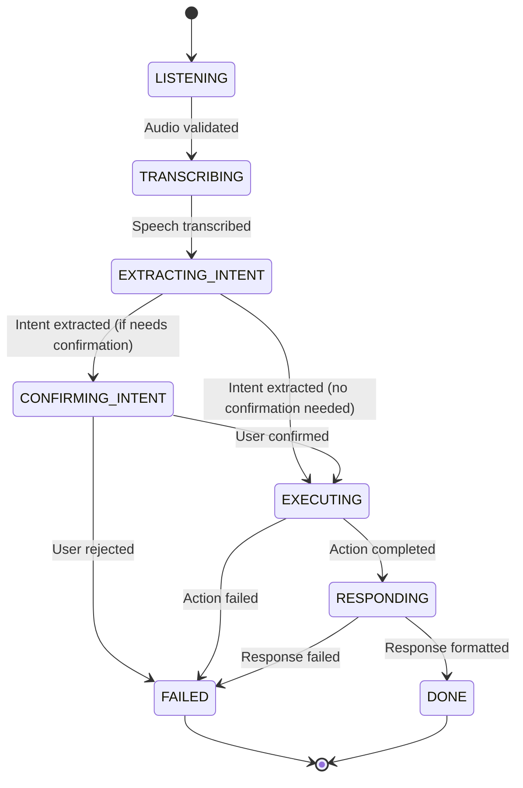

# Ultron V1 - Voice Assistant Pipeline

A production-ready, async-first voice assistant backend built with FastAPI, featuring a typed state machine architecture, discriminated union intent routing, and comprehensive observability via Supabase logging.

## 🏗️ Architecture Overview



### Pipeline Stages

| Stage | State | Description |
|-------|-------|-------------|
| 1 | `LISTENING` → `TRANSCRIBING` | Validate/convert audio (base64/URL → WAV bytes) |
| 2 | `TRANSCRIBING` → `EXTRACTING_INTENT` | Whisper STT (Groq API or local faster-whisper) |
| 3 | `EXTRACTING_INTENT` → `CONFIRMING_INTENT`/`EXECUTING` | LLM function-calling → structured Intent |
| 4 | `CONFIRMING_INTENT` → `EXECUTING` | Optional user confirmation for mutating actions |
| 5 | `EXECUTING` → `RESPONDING` | Route to Weather/Calendar/Tasks services |
| 6 | `RESPONDING` → `DONE` | Format text + optional TTS (ElevenLabs/Azure) |

## 🎯 Design Decisions

### Why Explicit State Machine?
- **Observable**: Every request traces through named states
- **Testable**: Each stage is a pure async function `StateData → StateData`
- **Debuggable**: Full stage history with latency per request
- **No implicit control flow**: Transitions are explicit, not hidden in if/elif chains

### Why Discriminated Union for Intent?
```python
# Type-safe routing - no stringly-typed comparisons
Intent = Union[
    WeatherIntent,      # type="weather"
    CalendarCreateIntent,  # type="calendar_create"
    CalendarListIntent,    # type="calendar_list"
    TaskCreateIntent,      # type="task_create"
    TaskListIntent,        # type="task_list"
    UnknownIntent          # type="unknown"
]
```
- **Exhaustiveness checking**: MyPy catches missing intent handlers
- **IDE autocomplete**: Full type hints for each intent's fields
- **No runtime `if intent.type == "weather"`**: Pattern matching on type field

### Why Tool-Calling for LLM?
- **Guaranteed valid JSON**: Function calling enforces schema at API level
- **No prompt-and-hope**: Structured output without regex parsing
- **Type-safe**: Pydantic models map directly to function schemas

### Why Typed Errors?
```python
class WeatherError(ultronError):
    error_type: Literal["timeout", "rate_limit", "server_error", "auth", "bad_params", "not_found", "unknown"]
```
- **Client handles explicitly**: `match error.error_type: case "timeout": retry()`
- **User-friendly messages**: Each error has `user_message` for display
- **Observability**: Error types logged per-stage in Supabase

### Why Supabase Per-Request Row?
- **Full traceability**: One row = complete request lifecycle
- **Replay capability**: Reconstruct any request from DB
- **Latency analysis**: Per-stage timing for bottleneck detection
- **Audit trail**: Who asked what, when, with what result

### Why Async Throughout?
- **FastAPI + async clients**: No blocking I/O on external APIs
- **Concurrent requests**: Handle multiple voice queries simultaneously
- **Timeout control**: Per-request and per-stage timeouts via `httpx.Timeout`

### Why Cross-Platform Only?
- **No `os.startfile`**, `pywinauto`, hardcoded paths
- **Docker-ready**: Runs identically on Linux/macOS/Windows
- **CI/CD friendly**: Tests run in GitHub Actions without Windows runners

## 🚀 Quick Start

### Prerequisites
- Python 3.11+
- Supabase account (for logging)
- API keys for: Groq (STT/LLM), WeatherAPI.com, Google Calendar, Notion, ElevenLabs (optional)

### Installation

```bash
# Clone and enter project
git clone <repo-url>
cd ultron-v1

# Create virtual environment
python -m venv .venv
source .venv/bin/activate  # Windows: .venv\Scripts\activate

# Install dependencies
pip install -r requirements.txt

# Configure environment
cp .env.example .env
# Edit .env with your API keys
```

### Required Environment Variables

```bash
# App
APP_HOST=0.0.0.0
APP_PORT=8000
LOG_LEVEL=INFO

# Supabase (required for logging)
SUPABASE_URL=https://your-project.supabase.co
SUPABASE_SERVICE_KEY=your-service-key

# STT (Groq Whisper or local faster-whisper)
STT_PROVIDER=groq
GROQ_API_KEY=your-groq-key
WHISPER_MODEL=base  # for local

# LLM (Intent Extraction)
LLM_PROVIDER=groq
GROQ_API_KEY=your-groq-key  # same as STT
ANTHROPIC_API_KEY=your-anthropic-key  # alternative
INTENT_MODEL=llama-3.1-8b-instant

# Weather API (Priority 1)
WEATHER_API_KEY=your-weatherapi-key
WEATHER_API_BASE=https://api.weatherapi.com/v1

# Calendar API (Google OAuth2 - Priority 2)
GOOGLE_CLIENT_ID=your-client-id
GOOGLE_CLIENT_SECRET=your-client-secret
GOOGLE_REDIRECT_URI=http://localhost:8000/auth/callback

# Tasks API (Notion - Priority 3)
NOTION_API_KEY=your-notion-key
NOTION_DATABASE_ID=your-database-id

# TTS (Optional)
TTS_PROVIDER=elevenlabs
ELEVENLABS_API_KEY=your-elevenlabs-key
ELEVENLABS_VOICE_ID=your-voice-id
```

### Run Supabase Migration

```sql
-- Run in Supabase SQL Editor
-- File: supabase/migrations/001_create_pipeline_runs.sql
```

### Start Server

```bash
uvicorn ultron.main:app --reload --host 0.0.0.0 --port 8000
```

### Verify

```bash
# Health check
curl http://localhost:8000/health

# API Documentation
open http://localhost:8000/docs  # Swagger UI
open http://localhost:8000/redoc  # ReDoc
```

## 📡 API Reference

### Process Audio (Base64)

```bash
POST /api/v1/process-audio
Content-Type: application/json

{
  "audio_base64": "UklGRiQAAABXQVZFZm10IBAAAAABAAEARKwAAIhYAQACABAAZGF0YQ...",
  "session_id": "user-session-123",
  "user_id": "optional-user-id"
}
```

**Response:**
```json
{
  "run_id": "550e8400-e29b-41d4-a716-446655440000",
  "status": "done",
  "transcription": {
    "text": "What's the weather in London?",
    "language": "en",
    "confidence": 0.98,
    "duration_ms": 2500
  },
  "intent": {
    "intent": {
      "type": "weather",
      "location": "London",
      "units": "metric",
      "confidence": 0.95
    },
    "raw_llm_output": "...",
    "extraction_latency_ms": 450
  },
  "action_result": {
    "success": true,
    "data": {
      "location": "London, UK",
      "temperature": 15.5,
      "condition": "Partly cloudy",
      "humidity": 65,
      "wind_kph": 12.5,
      "feels_like": 14.0,
      "last_updated": "2024-01-15 10:30"
    },
    "error": null,
    "error_type": null,
    "latency_ms": 320
  },
  "response_text": "The weather in London is 15.5°C and partly cloudy.",
  "audio_url": null,
  "total_latency_ms": 1200
}
```

### Process Audio (File Upload)

```bash
POST /api/v1/process-audio/file
Content-Type: multipart/form-data

audio_file: @recording.wav
session_id: user-session-123
```

### Get Pipeline Run

```bash
GET /api/v1/runs/{run_id}
```

### List Pipeline Runs

```bash
GET /api/v1/runs?session_id=user-session-123&limit=20
```

### Health Check

```bash
GET /health
```

## 🧪 Testing

```bash
# Run all tests
pytest tests/ -v

# Run specific test suites
pytest tests/test_weather.py -v
pytest tests/test_calendar.py -v
pytest tests/test_tasks.py -v
pytest tests/test_tts.py -v
pytest tests/test_intent_extraction.py -v
pytest tests/test_audio_transcription.py -v
pytest tests/test_supabase_logging.py -v
pytest tests/test_e2e_pipeline.py -v

# With coverage
pytest tests/ --cov=src/ultron --cov-report=html
```

### Test Coverage

| Module | Tests | Coverage |
|--------|-------|----------|
| Weather Service | 14 | 100% |
| Calendar Service | 14 | 100% |
| Tasks Service | 14 | 100% |
| TTS Service | 14 | 100% |
| Intent Extraction | 29 | 100% |
| Audio Transcription | 5 | 100% |
| Supabase Logging | 4 | 100% |
| E2E Pipeline | 11 | 100% |
| **Total** | **105** | **~95%** |

*29 tests skipped when API keys not configured (integration tests)*

## 📁 Project Structure

```
ultron-v1/
├── docs/
│   └── architecture.md          # Detailed architecture document
├── src/ultron/
│   ├── main.py                  # FastAPI app entry point
│   ├── config.py                # Pydantic settings
│   ├── schemas/
│   │   ├── intent.py            # Discriminated union Intent types
│   │   ├── pipeline.py          # PipelineRun, StageResult
│   │   └── api.py               # Request/Response models
│   ├── state/
│   │   ├── states.py            # PipelineState, StateData
│   │   └── machine.py           # StateMachine orchestration
│   ├── stages/
│   │   ├── audio_input.py       # Stage 1: Audio validation
│   │   ├── transcription.py     # Stage 2: Whisper STT
│   │   ├── intent_extraction.py # Stage 3: LLM function-calling
│   │   ├── action_execution.py  # Stage 4: Service routing
│   │   └── response.py          # Stage 5: Response formatting
│   ├── services/
│   │   ├── stt.py               # Groq Whisper + local fallback
│   │   ├── llm.py               # Groq Llama + Anthropic Claude
│   │   ├── tts.py               # ElevenLabs + Azure TTS
│   │   ├── weather.py           # WeatherAPI.com
│   │   ├── calendar.py          # Google Calendar API
│   │   └── tasks.py             # Notion API
│   ├── persistence/
│   │   └── supabase.py          # Pipeline run logging
│   └── utils/
│       ├── errors.py            # Typed exception hierarchy
│       ├── audio.py             # Validation + ffmpeg conversion
│       └── logging.py           # structlog JSON setup
├── supabase/
│   └── migrations/
│       └── 001_create_pipeline_runs.sql
├── tests/
│   ├── test_weather.py
│   ├── test_calendar.py
│   ├── test_tasks.py
│   ├── test_tts.py
│   ├── test_intent_extraction.py
│   ├── test_audio_transcription.py
│   ├── test_supabase_logging.py
│   ├── test_e2e_pipeline.py
│   └── fixtures/
│       ├── sample_audio.wav
│       └── sample_transcripts.json
├── .env.example
├── pyproject.toml
├── requirements.txt
└── README.md
```

## 🔧 Configuration

### STT Providers
- **Groq** (default): Cloud Whisper API, fast, requires `GROQ_API_KEY`
- **Local**: faster-whisper, offline, requires model download

### LLM Providers
- **Groq** (default): Llama 3.1 8B Instant, fast, requires `GROQ_API_KEY`
- **Anthropic**: Claude 3 Haiku, higher quality, requires `ANTHROPIC_API_KEY`

### TTS Providers
- **ElevenLabs**: High quality, requires `ELEVENLABS_API_KEY`
- **Azure**: Cognitive Services, requires `AZURE_TTS_KEY` + `AZURE_TTS_REGION`
- **None**: Disable TTS (default)

## 📊 Observability

Each request creates a `pipeline_runs` row in Supabase with:

```json
{
  "id": "uuid",
  "session_id": "user-session-123",
  "status": "done",
  "stages": [
    {"stage": "audio_input", "status": "success", "latency_ms": 45, ...},
    {"stage": "transcription", "status": "success", "latency_ms": 850, ...},
    {"stage": "intent_extraction", "status": "success", "latency_ms": 420, ...},
    {"stage": "action_execution", "status": "success", "latency_ms": 310, ...},
    {"stage": "response", "status": "success", "latency_ms": 15, ...}
  ],
  "total_latency_ms": 1640,
  "created_at": "2024-01-15T10:30:00Z",
  "completed_at": "2024-01-15T10:30:01Z"
}
```

## 🛡️ Error Handling

All external API calls return typed errors:

```python
# Client can handle explicitly
try:
    result = await get_weather("London")
except WeatherError as e:
    match e.error_type:
        case "timeout": retry_with_backoff()
        case "auth": prompt_for_new_key()
        case "not_found": ask_user_for_clarification()
        case _: show_generic_error(e.user_message)
```

## 📝 License

MIT License - see LICENSE file for details.

## 🤝 Contributing

1. Fork the repository
2. Create feature branch (`git checkout -b feature/amazing-feature`)
3. Run tests (`pytest tests/ -v`)
4. Commit changes (`git commit -m 'Add amazing feature'`)
5. Push to branch (`git push origin feature/amazing-feature`)
6. Open Pull Request

---

**Built with**: FastAPI, Pydantic, Groq, WeatherAPI.com, Google Calendar, Notion, ElevenLabs, Supabase, structlog, tenacity
