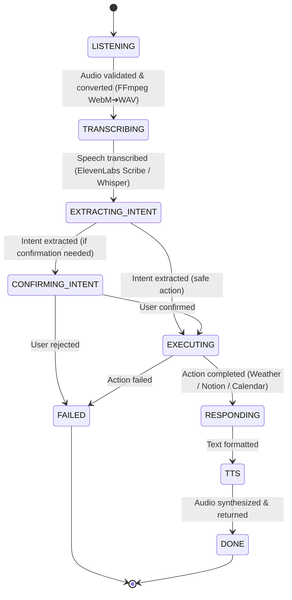

# ULTRON V1 🤖⚡

> **An Autonomous, Multi-Modal & Screen-Aware Voice AI Agent Engine**  
> *Built with FastAPI, Next.js 16, Pydantic Discriminated Unions, 7-Stage State Machine, and Supabase Telemetry.*

[](https://www.python.org/)
[](https://fastapi.tiangolo.com/)
[](https://nextjs.org/)
[](https://www.typescriptlang.org/)
[](LICENSE)

---

## 💡 What is Ultron V1?

**Ultron V1** (formerly *Jarvis 2.0*) is a production-grade, voice-first autonomous AI assistant. Unlike simple text-only chatbots, Ultron listens to spoken audio or typed prompts, extracts structured intent using function-calling LLMs, and **takes real action** across external services—fetching real-time weather forecasts, managing Notion task databases, and scheduling Google Calendar agendas, before speaking back to the user in a natural human voice.

```
┌─────────────────────────────────────────────────────────────┐
│                    ULTRON V1 VOICE PIPELINE                 │
│                                                             │
│ 🎙️ Voice Input ➔ 👂 STT ➔ 🧠 Intent ➔ ✋ Action ➔ 🗣️ TTS   │
└─────────────────────────────────────────────────────────────┘
```

---

## 📚 Project Documentation Hub

For detailed guides tailored for both technical and non-technical readers, explore the **[`docs/`](file:///d:/GitRepo/Jarvis%202.0/docs/README.md)** folder:

- 📄 **[Project Overview](file:///d:/GitRepo/Jarvis%202.0/docs/01_PROJECT_OVERVIEW.md)**: Conceptual summary with plain English human metaphors.
- 📜 **[Past Versions & Evolution](file:///d:/GitRepo/Jarvis%202.0/docs/02_PAST_VERSIONS_AND_EVOLUTION.md)**: Story of Jarvis 2.0 ➔ Ultron V1 & technical lessons.
- 🏗️ **[Current Architecture](file:///d:/GitRepo/Jarvis%202.0/docs/03_CURRENT_ARCHITECTURE.md)**: 7-Stage State Machine pipeline & tech stack breakdown.
- 🚀 **[Future Roadmap](file:///d:/GitRepo/Jarvis%202.0/docs/04_FUTURE_ROADMAP.md)**: The 8-Level Agentic Capability Ladder (Screen Vision, ReAct Planning, OS RPA).
- 🛠️ **[Non-Tech User Guide](file:///d:/GitRepo/Jarvis%202.0/docs/05_NON_TECH_USER_GUIDE.md)**: Simple step-by-step launch & voice prompt guide.
- 💻 **[Developer & File System Guide](file:///d:/GitRepo/Jarvis%202.0/docs/06_DEVELOPER_CONTRIBUTION_GUIDE.md)**: Directory map, request traces, & extension recipes.

---

## 🏗️ Architecture Overview



### 7-Stage Pipeline Breakdown

| Stage | State | Function | Primary Tech |
|-------|-------|----------|--------------|
| **1** | `LISTENING` ➔ `TRANSCRIBING` | Validates audio header & converts WebM bytes to WAV | Native header check + FFmpeg |
| **2** | `TRANSCRIBING` ➔ `EXTRACTING_INTENT` | Transcribes speech to clean text | ElevenLabs Scribe v2 / Groq Whisper |
| **3** | `EXTRACTING_INTENT` ➔ `EXECUTING` | Function-calling LLM extracts typed intent schema | Groq Qwen 3.6 / Llama 3 |
| **4** | `CONFIRMING_INTENT` ➔ `EXECUTING` | Confidence threshold & confirmation check | `src/ultron/stages/` |
| **5** | `EXECUTING` ➔ `RESPONDING` | Router executes API client (Weather, Notion, Calendar) | `src/ultron/services/` |
| **6** | `RESPONDING` ➔ `TTS` | Formats natural response text | `src/ultron/stages/response.py` |
| **7** | `TTS` ➔ `DONE` | Synthesizes response into realistic speech | ElevenLabs Multilingual v2 |

---

## 🎯 Key Design Principles

* **Explicit State Machine**: No hidden `if/elif` callback chains. Every request is an observable sequence of pure async stage functions.
* **Discriminated Union Intent Types**: Type-safe routing using Pydantic discriminated unions (`WeatherIntent`, `TaskCreateIntent`, `CalendarCreateIntent`).
* **Tool-Calling Enforcement**: Schema enforcement at the LLM API level ensures 100% valid JSON intent parsing without prompt-and-hope regex.
* **Typed Exception Hierarchy**: All service connectors inherit from `UltronError` with explicit error codes (`timeout`, `auth`, `rate_limit`, `bad_params`).
* **Full Per-Stage Observability**: Every request traces latency per stage into Supabase DB for instant bottleneck analysis.

---

## 🚀 Quick Start

### 1. Prerequisites
- **Python**: 3.11+
- **Node.js**: 18+ & NPM
- **FFmpeg**: Required for audio format conversion

### 2. Environment Setup

```bash
# Clone the repository
git clone https://github.com/LuckyRathee/ULTORN-v1.git
cd ULTORN-v1

# Setup Python Virtual Environment
python -m venv .venv
source .venv/bin/activate  # On Windows: .\.venv\Scripts\Activate.ps1

# Install Backend Dependencies
pip install -r requirements.txt

# Configure Environment Variables
cp .env.example .env
```

### 3. Required Environment Variables (`.env`)

Configure your API credentials in `.env`:

```env
# Application Settings
APP_HOST=0.0.0.0
APP_PORT=8000
LOG_LEVEL=INFO

# Supabase Telemetry (Optional / Recommended)
SUPABASE_URL=https://your-project.supabase.co
SUPABASE_SERVICE_KEY=your-supabase-service-key

# Speech-to-Text (STT)
STT_PROVIDER=elevenlabs # Options: elevenlabs, groq
ELEVENLABS_API_KEY=your-elevenlabs-api-key
GROQ_API_KEY=your-groq-api-key

# Intent LLM Extraction
LLM_PROVIDER=groq
INTENT_MODEL=qwen/qwen3.6-27b

# Service APIs
WEATHER_API_KEY=your-weatherapi-key
NOTION_API_KEY=your-notion-integration-key
NOTION_DATABASE_ID=your-notion-database-id
```

---

## 🏃 Launching the Application

### One-Click Windows Launcher (Recommended)
Double-click **`run_ultron.bat`** in the project root folder. It starts both the FastAPI backend (`:8000`) and Next.js frontend (`:2311`), automatically opening `http://localhost:2311` in your browser.

### Manual Server Startup

**Terminal 1 (Backend FastAPI):**
```bash
.\.venv\Scripts\Activate.ps1
uvicorn --app-dir src ultron.main:app --reload --host 0.0.0.0 --port 8000
```

**Terminal 2 (Frontend Next.js):**
```bash
cd frontend
npm run dev
```

---

## 📡 API Reference

### Health Check
```http
GET /health
```
**Response:**
```json
{
  "status": "healthy",
  "version": "1.0.0",
  "checks": { "supabase": "ok", "stt": "ok", "llm": "ok", "weather_api": "ok" },
  "uptime_seconds": 120
}
```

### Process Text Command
```http
POST /api/v1/process-text
Content-Type: application/json

{
  "text": "What is the weather in London?",
  "session_id": "session_user_123"
}
```

### Process Audio Command (Base64)
```http
POST /api/v1/process-audio
Content-Type: application/json

{
  "audio_base64": "<base64_encoded_wav_bytes>",
  "session_id": "session_user_123"
}
```

---

## 🧪 Testing

```bash
# Run unit test suite (excluding live API integration tests)
python -m pytest -m "not integration" -v

# Run full test suite with coverage report
python -m pytest --cov=src/ultron tests/

# Test Next.js frontend build
cd frontend && npm run build
```

---

## 🗂️ Project Directory Map

```
ULTORN-v1/
├── docs/                        # Complete Documentation Suite
├── src/ultron/                  # Backend Python Package
│   ├── main.py                  # FastAPI Application Routes & Entry Point
│   ├── config.py                # Environment Configuration Loader
│   ├── schemas/                 # Pydantic Schemas (Intent, API, Pipeline)
│   ├── state/                   # 7-Stage Typed State Machine Engine
│   ├── stages/                  # Pipeline Stage Execution Functions
│   ├── services/                # External Service Connectors (STT, LLM, TTS, Weather, Notion, Calendar)
│   ├── memory/                  # Session & Vector Store Engine
│   ├── briefing/                # Scheduled Daily Briefing Engine
│   ├── persistence/             # Supabase Run Logging
│   └── utils/                   # Audio conversion, Errors taxonomy, & Structlog
├── frontend/                    # Next.js 16 Sci-Fi HUD Cockpit Web App
│   └── src/
│       ├── app/                 # Next.js App Router Page & Layout
│       └── components/ui/       # Modular HUD Components (PulsarCore, PipelineTracker, UltronWidgets, HudHeader)
├── tests/                       # Pytest Suite (Unit & Integration tests)
├── .env.example                 # Environment variable template
├── pyproject.toml               # Build & dependencies config
└── run_ultron.bat               # One-click localhost launcher script
```

---

## 📝 License

This project is licensed under the **MIT License**. See [LICENSE](LICENSE) for details.

---

**Built with ❤️ by [Lucky Rathee](https://github.com/LuckyRathee)**  
*FastAPI • Next.js • Pydantic • Groq • ElevenLabs • WeatherAPI • Notion • Supabase*
