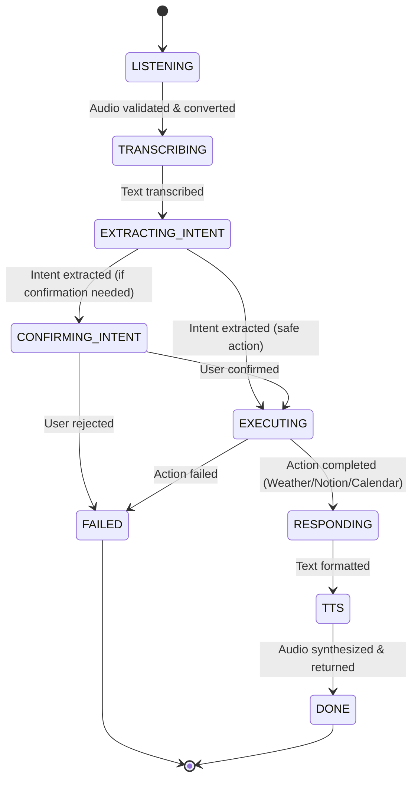

# 03. Current Architecture: How Ultron V1 Works Today 🏗️

This document provides both a high-level conceptual explanation and technical breakdown of **Ultron V1**'s architecture.

---

## 📊 The 7-Stage State Machine Pipeline

At the core of Ultron V1 is an **explicit assembly-line pipeline**. Every voice query or text command travels through named stages:

### Stage Breakdown Table

| Stage | Name | What Happens | Provider / Module |
|-------|------|--------------|-------------------|
| **01** | `LISTENING` | Validates audio header signatures and converts WebM to WAV bytes | `src/ultron/stages/audio_input.py` |
| **02** | `TRANSCRIBING` | Converts WAV audio bytes into clean text transcript | ElevenLabs Scribe v2 / Groq Whisper |
| **03** | `EXTRACTING_INTENT` | Parses text into structured JSON schemas using LLM tool-calling | Groq Qwen 3.6 / Anthropic Claude |
| **04** | `CONFIRMING_INTENT` | Verifies user intent confidence thresholds | `src/ultron/stages/intent_extraction.py` |
| **05** | `ACTION_EXECUTION` | Routes intent to external API (WeatherAPI, Notion, Calendar) | `src/ultron/services/` |
| **06** | `RESPONDING` | Formats action output into natural human response text | `src/ultron/stages/response.py` |
| **07** | `TTS` | Synthesizes response text into spoken MP3 audio | ElevenLabs TTS (`OFaywfVNe05ncpeSth45`) |

---

## 🛠️ Technology Stack Overview

### 1. Backend Infrastructure
* **Framework**: FastAPI (Python 3.11+) with full `async/await` non-blocking I/O.
* **State Machine**: Custom typed `StateMachine` class using Pydantic dataclasses.
* **Logging & Observability**: Structlog JSON logging + Supabase row tracing (`pipeline_runs` table).

### 2. Frontend Cockpit
* **Framework**: Next.js 16 (App Router + Turbopack) + React 19 + TypeScript.
* **Styling**: Tailwind CSS + Glassmorphism dark mode HUD aesthetic.
* **Audio Engineering**: Browser Web Audio API (`AudioContext` and `AnalyserNode`) for live microphone frequency metering.

### 3. Third-Party Integrations
* **Speech-to-Text (STT)**: ElevenLabs Speech-to-Text (Scribe v2) + Groq Whisper API fallback.
* **Intent LLM**: Groq Cloud (`qwen/qwen3.6-27b`) with tool-calling.
* **Text-to-Speech (TTS)**: ElevenLabs Multilingual v2 with custom Voice Design.
* **Task Database**: Notion Database API.
* **Weather Service**: WeatherAPI.com forecast queries.
* **Telemetry Store**: Supabase Database.
