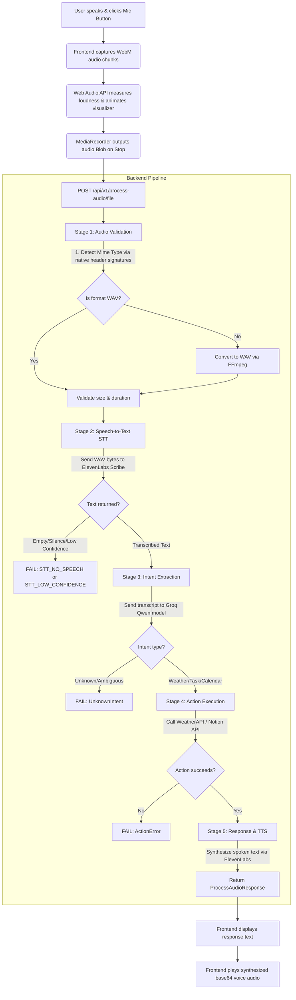

# Ultron V1 - How It Works & Diagnostic Flowchart

This document details the step-by-step data flow of the Ultron V1 voice assistant pipeline. Use this guide to easily visualize how your voice query travels from the browser to the backend, and how to pinpoint exactly where an error might be occurring.

---

## 📊 Pipeline Visual Flowchart

The following Mermaid diagram traces the path of a single voice query:



---

## 🔍 Step-by-Step Diagnostic Guide

Use this checklist to identify where the pipeline is breaking down:

### 🔴 Symptom 1: The visualizer bars do not bounce when I speak
* **What it means:** The frontend web browser is not capturing any audio signal from your microphone.
* **Potential Causes:**
  1. The browser does not have permission to access your microphone.
  2. The browser is capturing a virtual, disconnected, or incorrect default input device.
* **How to Fix:**
  * Click the lock icon in your browser URL bar next to `localhost:2311` and verify that the **Microphone** permission is set to **Allow**.
  * Check your system's default recording device (Windows Sound Control Panel) and make sure your active microphone is selected and unmuted.

### 🟡 Symptom 2: The visualizer bounces, but the sidebar history run status is `failed` and "User Query" shows `[tone]`, `[music]`, or `.`
* **What it means:** The audio file was sent to the backend, but the Speech-to-Text (STT) model heard only silence, static, or background noise instead of spoken words.
* **Potential Causes:**
  1. Your microphone volume is too low, or there is too much ambient background noise.
  2. The WebM to WAV conversion failed silently.
* **How to Fix:**
  * Speak closer to the microphone and enunciate clearly.
  * Check your backend terminal logs. If you see `Audio conversion failed`, verify that `ffmpeg` is installed and globally available in your environment PATH:
    ```powershell
    ffmpeg -version
    ```

### 🔵 Symptom 3: "User Query" shows the correct text of what I said, but the run status is `failed`
* **What it means:** Your microphone and Speech-to-Text (STT) are working 100% correctly! The breakdown is happening during **Stage 3 (Intent Extraction)** or **Stage 4 (Action Execution)**.
* **Potential Causes:**
  1. **Groq Model Key/Name Issue:** Groq returned an error during intent extraction (e.g. `404` or `401`).
  2. **Action API Credentials:** The Notion token or Weather API key is invalid or unauthorized.
* **How to Fix:**
  * Look at your backend terminal logs to see the traceback.
  * Click on the failed run in the **Session History** sidebar list. It will show a list of stages (e.g. `audio_input: success`, `transcription: success`, `intent_extraction: failed`).
  * If `intent_extraction` failed: Double check your `GROQ_API_KEY` in `.env`.
  * If `action_execution` failed: Double check your Notion database connection or Weather API key.
